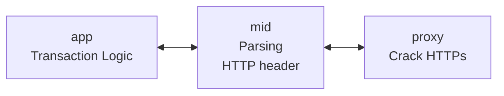
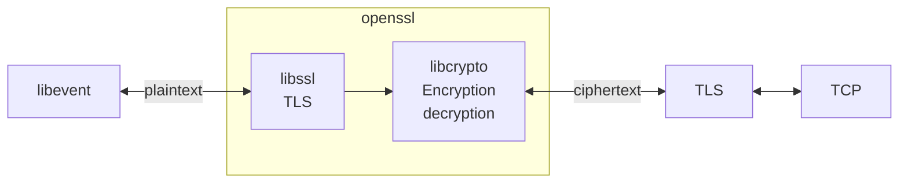
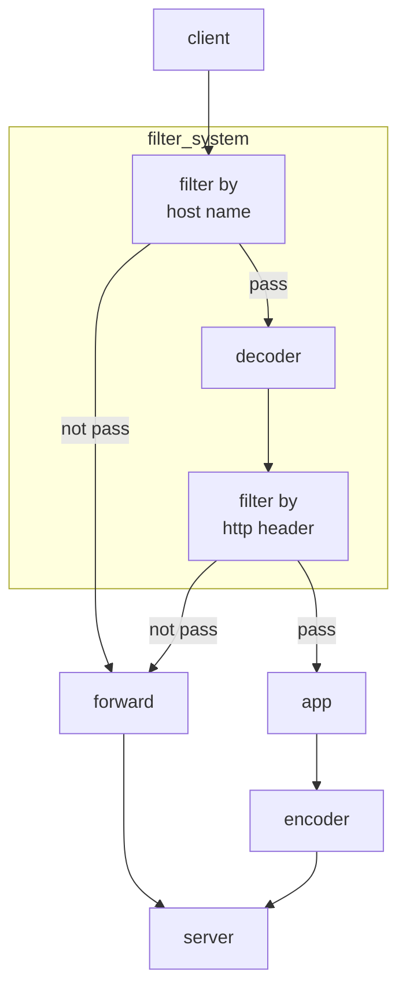

# MITM proxy

# Description

## Features

1. Http/https proxy
2. Regular expression find and replace for strings
3. Viewing and modifying the content of HTTP responses
4. Compression formats supported: **gzip, deflate, br**
5. Provide sample program: Modify content of the "Xueqiu" website
6. Based on this proxy, a WeChat video downloader has been developed
7. Supports viewing and modifying HTTP responses with **chunked**

## Limitations

1. **Does not support modifying HTTP requests**, only allows viewing HTTP requests

1. Requires **manual certificate installation** (during the first run)

   

# Software Architecture

## 1- level

3 levels:

1. app
2. mid
3. proxy

## 2 - implementation

## 3 - filter system

# Installation

1.  xxxx
2.  xxxx
3.  xxxx

# Instructions

1.  xxxx
2.  xxxx
3.  xxxx

# Contribution

1.  Fork the repository
2.  Create Feat_xxx branch
3.  Commit your code
4.  Create Pull Request

# Gitee Feature

1.  You can use Readme\_XXX.md to support different languages, such as Readme\_en.md, Readme\_zh.md
2.  Gitee blog [blog.gitee.com](https://blog.gitee.com)
3.  Explore open source project [https://gitee.com/explore](https://gitee.com/explore)
4.  The most valuable open source project [GVP](https://gitee.com/gvp)
5.  The manual of Gitee [https://gitee.com/help](https://gitee.com/help)
6.  The most popular members  [https://gitee.com/gitee-stars/](https://gitee.com/gitee-stars/)
