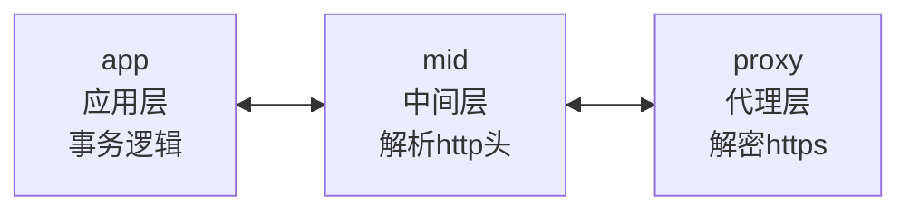
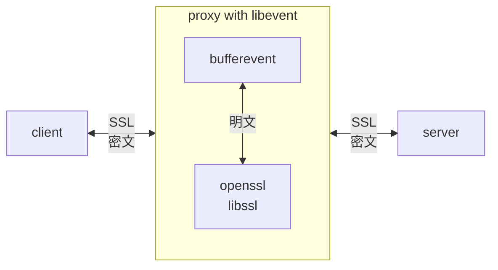
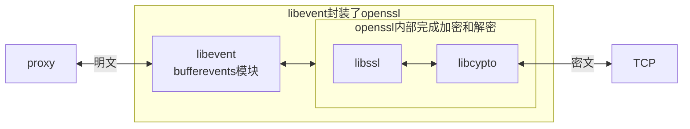
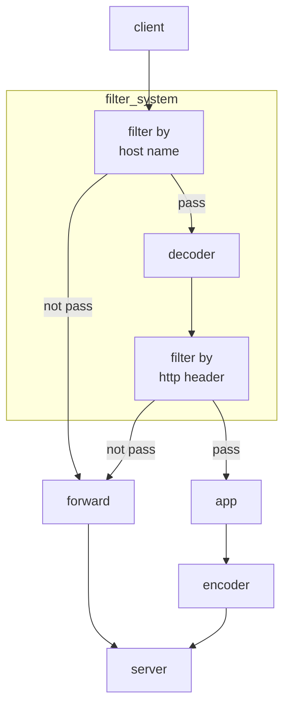
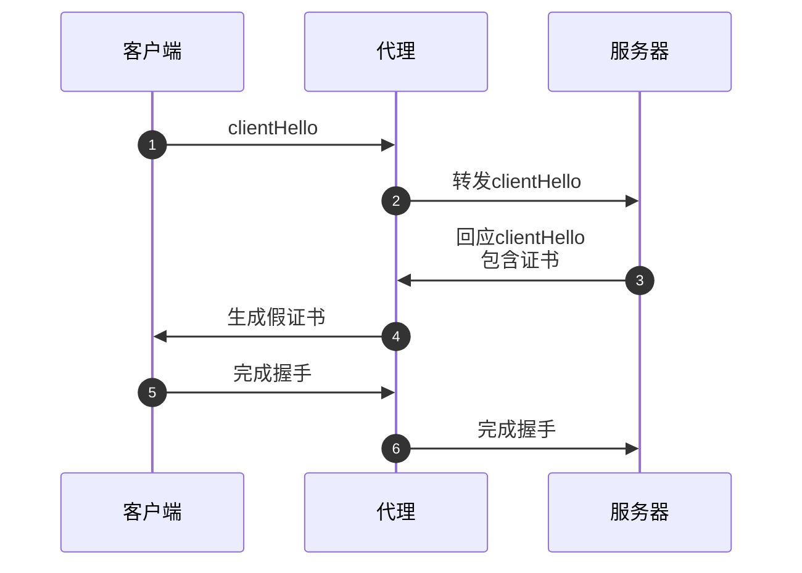
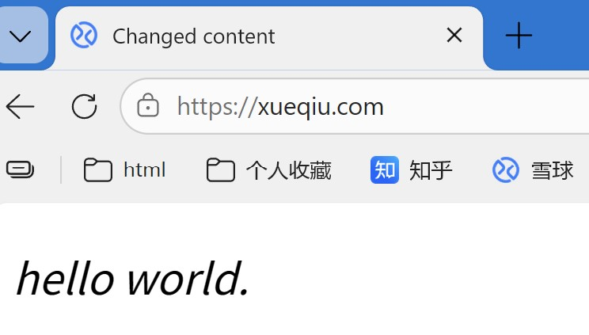

# MITM 代理

MITM代理，解密/修改 https 流量


## 开发环境

运行平台： windows 10 专业版 （版本 22H2）

开发工具：VS2022 社区版

开发语言：C 语言


## 开源代码

以下是本项目采用的开源代码：


| 开源代码 | 版本   | 备注                                           |
| -------- | ------ | ---------------------------------------------- |
| openssl  | 3.5.4  | SSL 协议，网站下载编译好的SDK，动态链接库      |
| libevent | 2.1.12 | 异步事件库，静态链接库                         |
| zlib     | 1.3.1  | gzip/deflate 算法，HTTP 内容解压缩，静态链接库 |
| Brotli   | 1.2.0  | Brotli 算法，HTTP 内容解压缩，静态链接库       |
| PCRE2    | 10.46  | 正则表达式查找和替换，静态链接库               |


## 特征

解密和修改 https 流量。

1. 支持 HTTP 压缩和解压：Brotli，gzip，deflate
2. 支持正则表达式查找和修改字符串
3. 支持微信短视频播放和下载


------

# 软件架构


## 设计原则

代理设计原则：

- 代理尽可能简洁
- 代理只负责加密和解密
- 其它逻辑尽量放在应用层


应用层：只负责**事务逻辑**，Transaction Logic

中间层：只负责**解析** http，parse http header

代理层：只负责**破解** https 流量，crack https




## 总体架构

整体架构



代理的内部结构




## 2层过滤系统

默认：代理可以设置为2种工作模式。

1. 直通模式 WORK_MODE_FORWARD：代理不解密，只是转发数据
2. 解密模式 WORK_MODE_MITM：解密 https，这是默认模式


如果代理工作在 WORK_MODE_MITM，则开始解密 https。

此时，过滤系统生效。




有2次过滤机会：

1. 客户端和服务器刚**开始建立连接**时。

此时还**没有破解 https**，只知道服务器的名称，根据服务器名破解。

比如应用程序只需要破解包含 “xueqiu”，即只想破解“雪球”网站，则代码如下：

```
enum FILTER_RESULT cb_host_localhost(const char* host_name)
{
	if (strstr(host_name, "xueqiu")) {
		return FILTER_RESULT_SPLIT; //crack this website
	}
	return FILTER_RESULT_PASS; //forward only
}
register_filter_cb_host(mitm, cb_host_localhost);
```

2. 第2次过滤：发生在**破解之后**。

此时，代理**已经破解了 https**，并且得到了客户端和服务器通讯的 http 头。

包含 http request 和 http response 头。

这其中的信息，足够让应用程序做出二次过滤，看是不是真的需要这些数据。

 比如下面的代码：想破解微信短视频，则关注所有 "qq.com" 的流量。

但是，"qq.com" 的相关网站很多，所以需要二次过滤。

**register_filter_cb_cared**(mitm, is_cared_info);

is_cared_info：代理在得到客户端和服务器通讯的 http 请求和响应头之后，将调用这个函数。

如果关注，is_cared_info 返回1；否则返回 0

```c++
enum FILTER_RESULT cb_host_wechat(const char* host_name, void* arg)
{
	if (strstr(host_name, "qq.com")) {
		return FILTER_RESULT_SPLIT;
	}

	if (strstr(host_name, "httpbin")) {
		return FILTER_RESULT_SPLIT;
	}

	return FILTER_RESULT_PASS; //forward only
}
register_filter_cb_host(mitm, cb_host_wechat);

const char js_type_str[] = "application/javascript";
const char virtual_svg_str[] = "virtual_svg-icons-register.publish";

int is_cared_info(http_info_t* phi, void* arg)
{
	//not find Content-Type in http header
	if (!phi->http_content_type || !phi->http_uri)
		return 0;

	if (_strnicmp(js_type_str, phi->http_content_type, strlen(js_type_str))) {
		return 0;
	}
	//here, Content-Type: application/javascript\r\n
	///uri: t/wx_fed/finder/web/web-finder/res/js/virtual_svg-icons-register.publishDJmRcesj.js
    //start point to virtual_svg-icons-register.publishDJmRcesj.js
	char* start = get_file_name_from_uri(phi->http_uri);
	if (!start)
		return 0;
	if (_strnicmp(start, virtual_svg_str, strlen(virtual_svg_str))) {
		return 0;
	}

	//virtual_svg-icons-register.publish...
	return 1;
}

register_filter_cb_cared(mitm, is_cared_info);
```

上面的代码，只关注：

文件类型：application/javascript

URI 路径中包含：virtual_svg-icons-register.publish

其他不关注。


2次过滤后：

如果没有通过过滤，则代理直接转发数据，不会调用应用程序的回调函数。

通过过滤后，代理才会调用回调函数。

```c
int http_response(void* arg, http_info_t* http_ctx,
	char** out, size_t* out_len, int* need_free)
{
	if (!http_ctx->http_content_length)
		return 0;

	if (!http_ctx->response) {
		//handle http request
		http_request(http_ctx);
		return 0;
	}

	//here, http response
	printf("http_response: %s len is %lld\n", http_ctx->http_uri, http_ctx->http_content_length);
	char* chg;
	chg = replace_js(http_ctx->http_content, http_ctx->http_content_length, out_len);
	*out = chg;
	printf("replace OK, len is %lld\n\n", *out_len);

	*need_free = 1;
	return 1;
}

register_action_cb_http(mitm, http_response);
```

以上代码，实现了网页内容修改。


### 为什么需要2次过滤？

因为微信视频服务器和浏览器的数据量很大。

默认的，大多数的数据流：**直接转发**，应用无需关心。比如视频流，音频流，图片等。

真正关心的是**视频的标题，加密种子，视频链接**，这些信息在特定网页中。

应用只关心这些网页。

代理给应用传送特定网页内容即可。

这些网页的内容，往往是http服务器 压缩过的，代理还负责解压。

如果网页内容修改了，代理还要负责压缩后再发出。

为了节省CPU 和内存资源，所以定义2层过滤系统。


## TLS握手

代理对于客户端：假扮远程服务器，好像客户端和真正的Web服务器通讯；

代理对于Web服务器：假扮客户端。

一次典型的 TLS 握手过程如下：



完成握手后，代理同时管理2条链接：

- 和客户端的连接：代理作为服务器，有服务器私钥，可以加密和解密
- 和服务器的连接：代理作为客户端，有客户端私钥，可以加密和解密


# 使用MITM

sample 目录下有一个简单的示例。


## 资源

使用MITM 代理，需要3个文件：

**头文件**： mitm\mitm.h

**动态链接库**：release\cmitmproxy.dll

动态链接库符号表：cmitmproxy.lib


资源文件：

**CA证书**：release\res\RootCA.crt

**CA私钥**：RootCA.key

安装 RootCA.crt 证书，安装到受信任的根证书颁发机构。


## 示例代码

示例代码的作用：这个代理不仅可以破解https 流量，还可以修改流量。


只关注主机名是 xueqiu 的流量； 访问其它网站不受影响。

当浏览器访问 xueqiu 网站时，无论之前的网页内容如何，统一修改为 html_changed 这个网页。


```c
#include "mitm.h"

static char html_changed[] = "\
<!DOCTYPE html>\n\
<html>\n\
<head>\n\
<title>Changed content</title>\n\
</head>\n\
<body>\n\
<p><em>hello world.</em></p>\n\
</body>\n\
</html>\n\
";

enum FILTER_RESULT cb_host_localhost(const char* host_name, void* arg)
{
	if (strstr(host_name, "xueqiu")) {
		return FILTER_RESULT_SPLIT; //crack this website
	}
	return FILTER_RESULT_PASS; //forward only
}

int http_response(
	void* arg, http_info_t* http_ctx, //in
	char** out, size_t* out_len, FreeFunc* cb_free)
{
	//only care http response
	if (!http_ctx->response)
		return 0;

	//not find Content-Type in http header
	if (!http_ctx->http_content_type) 
		return 0;

	//Content-Type: text/html\r\n
	if (_strnicmp("text/html", http_ctx->http_content_type, strlen("text/html")))
		return 0;

	//printf("%s body len is %lld\n", http_ctx->http_uri, http_ctx->http_content_length);
	//changed html content
	*out = html_changed;
	*out_len = strlen(html_changed);
	*cb_free = NULL; //no need free
	return 1;
}

int cb_cared(http_info_t* http_ctx, void* arg)
{
	if (!http_ctx->http_content_length || !http_ctx->http_host)
		return 0;

	if(!strcmp(http_ctx->http_host, "xueqiu.com")){
		printf("app will inject website \"%s\", arg is \"%s\"\n",
			http_ctx->http_host, (char*)arg);
		return 1;
	}
	
	return 0;
}

int main(int argc, char** argv)
{
	int ret = -1;
	mitm_ctx* mitm = mitm_init(DEFAULT_PROXY_ADDR, DEFAULT_PROXY_PORT);
	if (!mitm)
		goto fail;
	//define filter system
	register_filter_cb_host(mitm, cb_host_localhost);
	register_filter_cb_cared(mitm, cb_cared);
	register_action_cb_http(mitm, http_response);

	char* app_arg = malloc(32);
	strcpy(app_arg, "hello world");
	mitm_run(mitm, app_arg); //main loop
	free(app_arg);
	ret = 0;
fail:
	mitm_exit(mitm);
	return ret;
}
```


## 大框架

初始化：mitm_init

注册回调函数：register_filter_cb_host， register_action_cb_http

运行代理：mitm_run，直到用户按下 ctrl + c ，代理才会结束

清理内存：mitm_exit


## 回调函数

```c
enum FILTER_RESULT cb_host_localhost(const char* host_name, void* arg)
{
	if (strstr(host_name, "xueqiu")) {
		return FILTER_RESULT_SPLIT; //crack this website
	}
	return FILTER_RESULT_PASS; //forward only
}
```


```c
int http_response(
	void* arg, http_info_t* http_ctx, //in
	char** out, size_t* out_len, FreeFunc* cb_free)
{
	//only care http response
	if (!http_ctx->response)
		return 0;

	//not find Content-Type in http header
	if (!http_ctx->http_content_type) 
		return 0;

	//Content-Type: text/html\r\n
	if (_strnicmp("text/html", http_ctx->http_content_type, strlen("text/html")))
		return 0;

	//printf("%s body len is %lld\n", http_ctx->http_uri, http_ctx->http_content_length);
	//changed html content
	*out = html_changed;
	*out_len = strlen(html_changed);
	*cb_free = NULL; //no need free
	return 1;
}
```


## 默认值

如果不注册回调函数，则默认情况下，代理工作在 MITM 模式。

即破解所有流量，但是不修改流量。

register_filter_cb_host：注册自己的处理函数，可以只破解关注的流量，其它流量不破解；

```c
typedef enum FILTER_RESULT (*cbfilter_by_host)(const char* host_name, void* arg);
```


register_action_cb_http：注册自己的处理函数。只破解关注的流量，并且可能修改流量

```c
typedef void (*FreeFunc)(void*);
/*
* in:
       arg: in/out used for app
	   info: http info

   out: 
        if changed html content, put changes to out[out_len]
		free_func:
			proxy will call  cb_free(out) after use it
			if cb_free is NULL, proxy not free
		e.g.
		*cb_free = NULL, proxy not free memory;
		*cb_free = free, proxy will call free(out)
return:
    if changed html content, return 1; 
    otherwise return 0
*/
typedef int (*cb_http_response)(
	void* arg, http_info_t* info, //in
	char** out, size_t* out_len, FreeFunc* cb_free); //out

/*
	if need change content, should call register_filter_cb_cared();
	and cbfilter_by_http_header() return 1 if change specified content.

	this is called after TLS cracked.
	when proxy got first http response packet,
	after proxy parsed http response header, will call this function

	app tell proxy: app need peek or modify http content
	return 1, if want to modify it
	return 0, just peek
*/
typedef int (*cbfilter_by_http_header)(http_info_t *phi, void* arg);
void register_filter_cb_cared(mitm_ctx* ctx, cbfilter_by_http_header cbfunc);
```

修改网页内容，回调函数返回1；

如果没有修改，则返回0


------

# demo

以下操作都在本机 Win10 系统上操作。


## 1 - 编译

VS2022 编译。

打开 vsproj\cmitmproxy.sln，release/x64，编译结果：

动态链接库：cmitmproxy.dll 和 cmitmproxy.lib


打开 sample\sample.sln，编译结果：

sample.exe

编译结果都放在 release 目录下。


## 2 - 测试

再次强调：先要安装证书。

安装 release\res\RootCA.crt 证书，安装到“**受信任的根证书颁发机构**”。

右键点击证书，选择“安装证书”即可。


运行 sample.exe 的启动界面如下：

```bash
proxy mode: decrypt specified https traffic
proxy mode: filter by cared

MITM proxy listening at 127.0.0.1:8080
("stop this proxy by press key: ctrl+c")
Starting main loop. Accepting connections.
```


用浏览器访问 

```url
https://xueqiu.com/
```


原始的网页内容：


运行 sample.exe 后，将会修改网页，内容如下：




------


# 相关文章


[mitm-1-实现思路 - 知乎](https://zhuanlan.zhihu.com/p/1979186130697082266)

[mitm-2-使用 mtim库 - 知乎](https://zhuanlan.zhihu.com/p/1981354362463859347)

[mitm-3-mitm实现1-总体架构 - 知乎](https://zhuanlan.zhihu.com/p/1981642421898085460)

[mitm-4-mitm实现2-破解https - 知乎](https://zhuanlan.zhihu.com/p/1984344015877997443)

[mitm-5-mitm实现3-假证书 - 知乎](https://zhuanlan.zhihu.com/p/1986144605582942558)

[mitm-6-mitm实现4-中间层 - 知乎](https://zhuanlan.zhihu.com/p/1986694682420483092)

[mitm-7-mitm实现5-修改网页 - 知乎](https://zhuanlan.zhihu.com/p/1986733580605473879)
