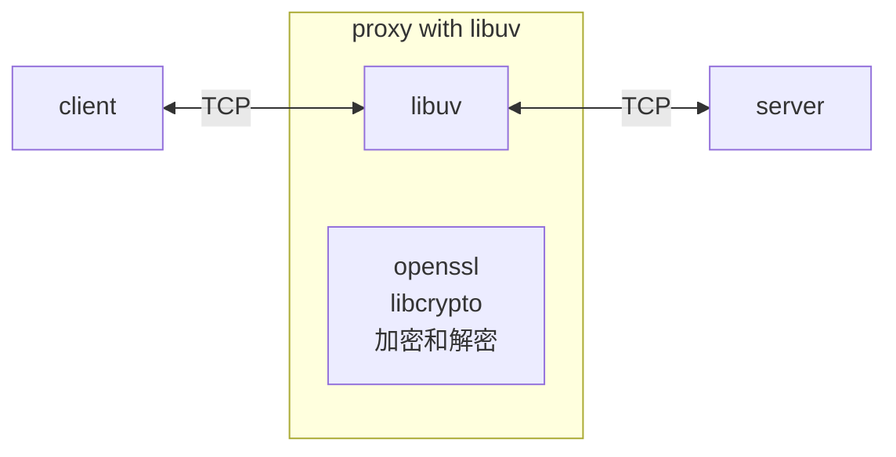
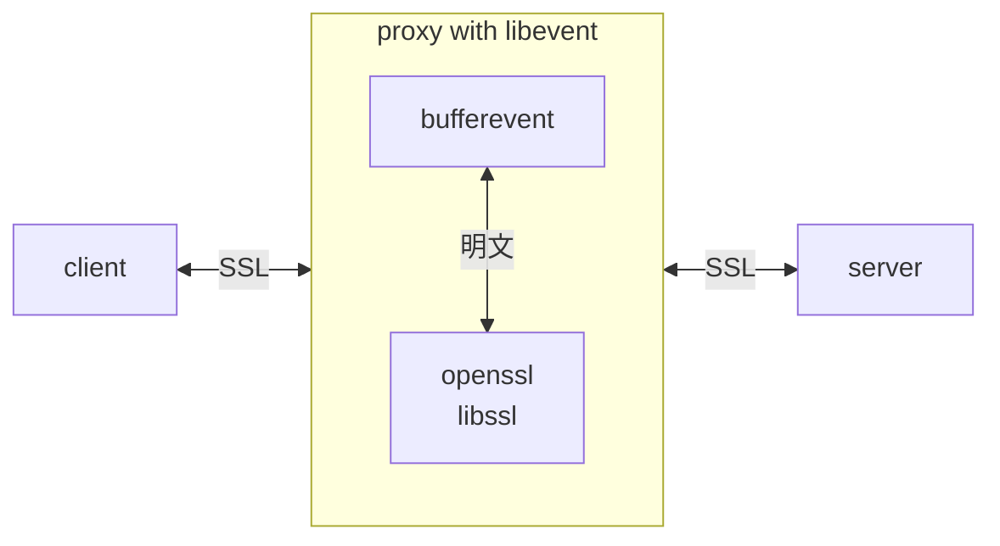
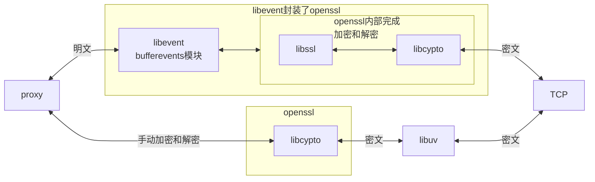
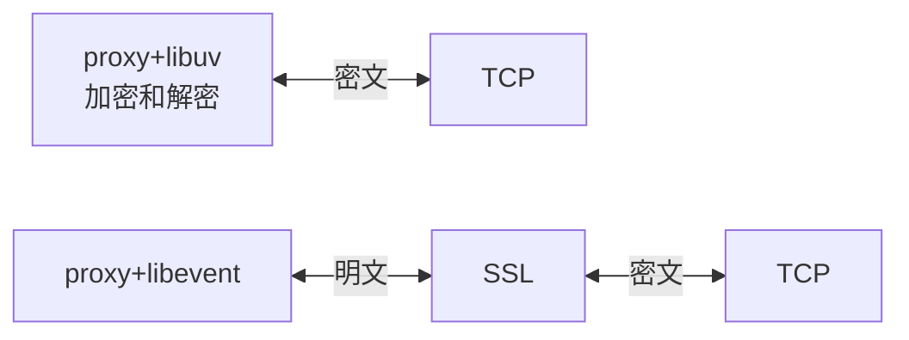

# mitm-1-实现思路

2025/12/2 写

# 什么是MITM

**MITM**（中间人攻击，Man-in-the-Middle Attack）是一种网络安全攻击方式，指攻击者秘密地介入两个通信方之间，窃听、篡改或伪造通信数据，而通信双方却认为他们在直接与对方通信。

本文仅聚焦**破解和修改 https** 流量。

## 常用MITM 工具

- Burp Suite
- Fiddler
- mitmproxy
- ......

以下是常用 MITM 工具对比

| 工具           | 主要开发接口    | 语言支持    |
| :------------- | :-------------- | :---------- |
| **mitmproxy**  | Python API      | Python      |
| **Burp Suite** | Java/Python API | Java/Python |
| **Fiddler**    | .NET/JScript    | C#/JScript  |
| **Charles**    | JavaScript      | JS          |
| **OWASP ZAP**  | REST/Java API   | Java/Python |
| **BetterCAP**  | Go/Lua          | Go/Lua      |
| **ProxyMan**   | JavaScript      | Java        |

从上表中可以看出，

MITM的开发语言：Python，Java，c#， Go， JavaScript。

扩展接口的开发语言：Python，Java，c#， Go， JavaScript

所以，当今世界上没有一款**开源**，**C语言**实现的，能在 **Windows 上运行**的 MITM 代理。

所以，想实现一个C语言版本的MITM 代理。

------

# 开源库

运行平台： windows 10 专业版 （版本 22H2）

开发工具：VS2022 社区版

开发语言：C 语言

Wireshark：4.6.0， 抓包分析工具，开发阶段用于调试

nginx：1.28.0，https 服务器，用于测试

最终的可执行程序：cmitmproxy.exe

本项目用到的**开源 C 语言库**如下：

| 开源代码 | 版本   | 备注                                    |
| -------- | ------ | --------------------------------------- |
| openssl  | 3.5.4  | SSL 协议和密码学库，官网下载编译好的SDK |
| libevent | 2.1.12 | 异步事件库，自己编译为静态链接库        |

# 原理

简单的说，就是两边欺骗。MITM 代理就是一个骗子：

对于客户端：MITM 代理作为服务器

对于服务器：MITM 代理作为客户端

截取客户端和服务器之前的通讯，解密甚至修改。

## 实现难点

1. ssl 协议
2. 加密和解密
3. https 证书

# 实现思路1：TCP 层

最开始，我使用了 libuv，和 Openssl 的密码学库 libcrypto。

虽然可以实现，但是相当复杂，对于各种加密解密细节都需要学习。

libuv + libcrypto 方案如下：

# 实现思路2：SSL 层

后来经过研究，发现 libevent 封装了 openssl，用libvent 实现 MITM 代理很简单。

[Bufferevents: advanced topics](https://libevent.org/libevent-book/Ref6a_advanced_bufferevents.html)

Bufferevents can use the OpenSSL library to implement the SSL/TLS secure transport layer. Because many applications don’t need or want to link OpenSSL, this functionality is implemented in a separate library installed as "libevent_openssl". Future versions of Libevent could add support for other SSL/TLS libraries such as NSS or GnuTLS, but right now OpenSSL is all that’s there.

OpenSSL functionality was introduced in Libevent 2.0.3-alpha, though it didn’t work so well before Libevent 2.0.5-beta or Libevent 2.0.6-rc.

This section is not a tutorial on OpenSSL, SSL/TLS, or cryptography in general.

These functions are all declared in the header "event2/bufferevent_ssl.h".

libevent + Libssl 方案如下：

# 方案对比

|            | libuv           | libevent        |
| ---------- | --------------- | --------------- |
| 接口难度   | 简单            | 复杂            |
| 底层库     | libcrypto：复杂 | libssl：不难    |
| 代理工作在 | TCP层           | SSL 层          |
| 难点       | 加密和解密      | 无需加密和解密  |
| 特点       | 自己完全控制    | 依靠 openssl 库 |

再来一个对比图：

上面的路径采用 libevent 方案；

下面的路径采用 libuv 方案。

# 结论

如果采用 libuv ，架构简单，但是需要自己处理加密和解密；

如果采用 libevent，看着复杂，但是无需处理加密和解密，libevent 封装好了。

所以，最终采用了 **libevent + Libssl** 方案。

无需重复造轮子，libevent 已经做的足够好了。

以下是极简架构示例：

