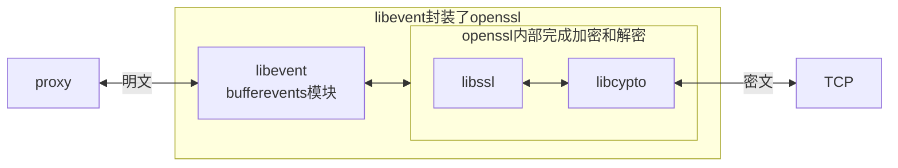

# mitm-2-使用 mtim库

2025/12/8 写


# 基本情况


## 当前进度

现在已经完成了一个简单的 MITM 库。

写了一个简单的 demo。

当前版本号：V0.19，本地仓库中。


当前的 MITM 库能做什么？

解密 HTTPs；

修改 HTTPs 流量。


## 开发环境

运行平台： windows 10 专业版 （版本 22H2）

开发工具：VS2022 社区版

开发语言：C 语言


| 开源代码 | 版本   | 备注                          |
| -------- | ------ | ----------------------------- |
| openssl  | 3.5.4  | SSL 协议，网站下载编译好的SDK |
| libevent | 2.1.12 | 异步事件库                    |


## 设计原则

代理设计原则：

- 代理尽可能简洁
- 代理只负责加密和解密
- 其它逻辑尽量放在应用层


## 结构简图



------


# 使用

本文不讲述代理是如何实现的，先讲述如何使用这个代理。


## 接口

运行环境：Windows

对外接口：c语言


使用MITM 代理，需要3个文件：

**头文件**： mitm\mitm.h

**动态链接库**：release\cmitmproxy.dll

动态链接库符号表：cmitmproxy.lib


运行时需要开源库 Openssl 的2个动态链接库：

libcrypto-3-x64.dll， libssl-3-x64.dll


2个资源文件：

**CA证书**：release\res\RootCA.crt

**CA私钥**：RootCA.key

安装 RootCA.crt 证书，安装到**受信任的根证书颁发机构**。


## demo

示例代码：可以破解https 流量，还可以修改流量。


用浏览器访问 

```url
https://xueqiu.com/
```


原始的网页内容：


运行 sample.exe 后，将会修改网页。再次访问网站时，内容被篡改：


------

# 程序接口


```c
/* filter */
enum WORK_MODE {
    WORK_MODE_FORWARD = 0, //HTTPS proxy
    WORK_MODE_MITM //mitm proxy
};
enum FILTER_RESULT {
    FILTER_RESULT_PASS = 0, //forward only
    FILTER_RESULT_SPLIT, //decrypt https traffic
};

typedef struct http_info {
	//http request or response
	int response; //response=0, http requst; response=1, http response

	//http header
	char* http_method;
	char* http_uri;
	char* http_host;
	char* http_content_type;

	//http body
	char* http_content;
	size_t http_content_length;
}http_info_t;

typedef enum FILTER_RESULT (*cbfilter_by_host)(const char* host_name);
typedef int (*cb_http_response)(
	void* arg, http_info_t* info, //in
	char** out, size_t* out_len, int *need_free); //out

mitm_ctx* mitm_init(char* ip, unsigned short port);
void mitm_exit(struct mitm_ctx_st* ctx);
int mitm_run(struct mitm_ctx_st* ctx, void* arg);

void mitm_set_work_mode(mitm_ctx* ctx, enum WORK_MODE mode);

void register_filter_cb_host(mitm_ctx* ctx, cbfilter_by_host cbfunc);
void register_action_cb_http(mitm_ctx* ctx, cb_http_response on_response);
```


## 简单示例

初始化：mitm_init

注册回调函数：register_filter_cb_host， register_action_cb_http

运行代理：mitm_run，直到用户按下 ctrl + c ，代理才会结束

清理内存：mitm_exit

完整代码如下：

```c
int main(int argc, char** argv)
{
	int ret = -1;
	mitm_ctx* mitm = mitm_init(DEFAULT_PROXY_ADDR, DEFAULT_PROXY_PORT);
	if (!mitm)
		goto fail;
	//define filter system
	register_filter_cb_host(mitm, cb_host_localhost);
	register_action_cb_http(mitm, http_response);

	mitm_run(mitm, NULL);//main loop
	ret = 0;
fail:
	mitm_exit(mitm);
	return ret;
}
```

这样的代码，就可以破解 https 流量，并且修改流量。


## 修改后的网页

其实就是显示了一行：

**hello world.**


```bash
static char html_changed[] = "\
<!DOCTYPE html>\n\
<html>\n\
<head>\n\
<title>Changed content</title>\n\
</head>\n\
<body>\n\
<p><em>hello world.</em></p>\n\
</body>\n\
</html>\n\
";
```


## 回调函数

cb_host_localhost：

对于需要破解的流量，返回FILTER_RESULT_SPLIT；

否则返回 FILTER_RESULT_PASS。

```c
enum FILTER_RESULT cb_host_localhost(const char* host_name)
{
	if (strstr(host_name, "xueqiu")) {
		return FILTER_RESULT_SPLIT; //只破解这个网站
	}
	return FILTER_RESULT_PASS; //forward only
}
```


http_response：

修改网页内容，回调函数返回1；

如果没有修改，则返回0

```c
int http_response(void* arg, http_info_t* http_ctx,
	char** out, size_t* out_len, int* need_free)
{
	//only care http response
	if (!http_ctx->response)
		return 0;

	//not find Content-Type in http header
	if (!http_ctx->http_content_type) 
		return 0;

	//Content-Type: text/html\r\n
	if (_strnicmp("text/html", http_ctx->http_content_type, strlen("text/html")))
		return 0;

	//changed html content
	*out = html_changed;
	*out_len = strlen(html_changed);
	*need_free = 0;
	return 1;
}
```


------


# 未来

未来还需要做的：

1. 完善文档
2. 更多的测试
3. 用这个 MITM 库，实现微信短视频下载

