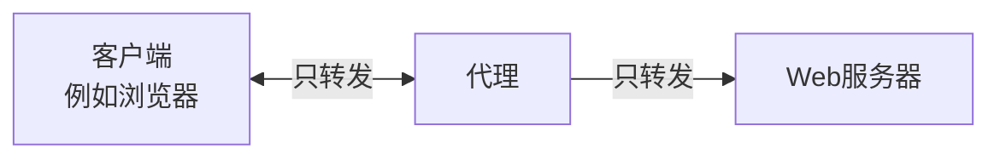
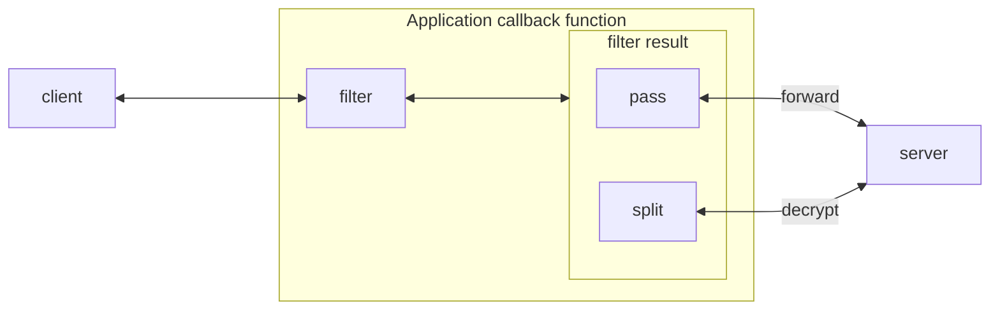
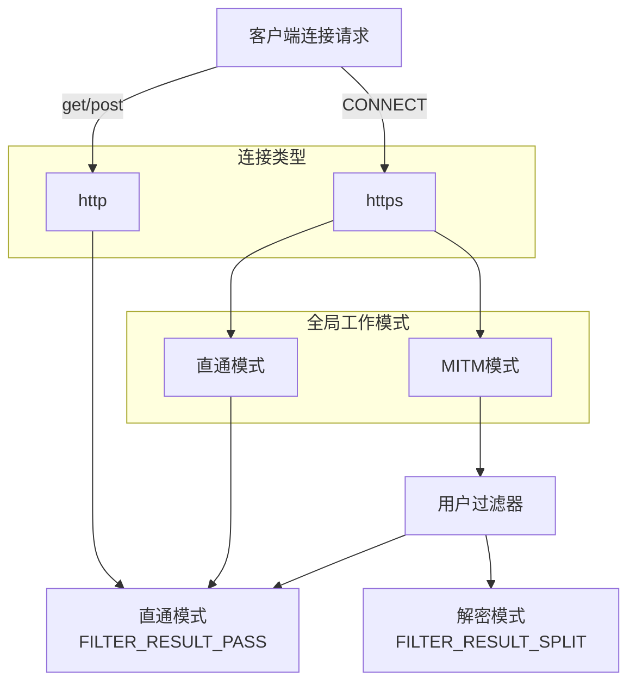
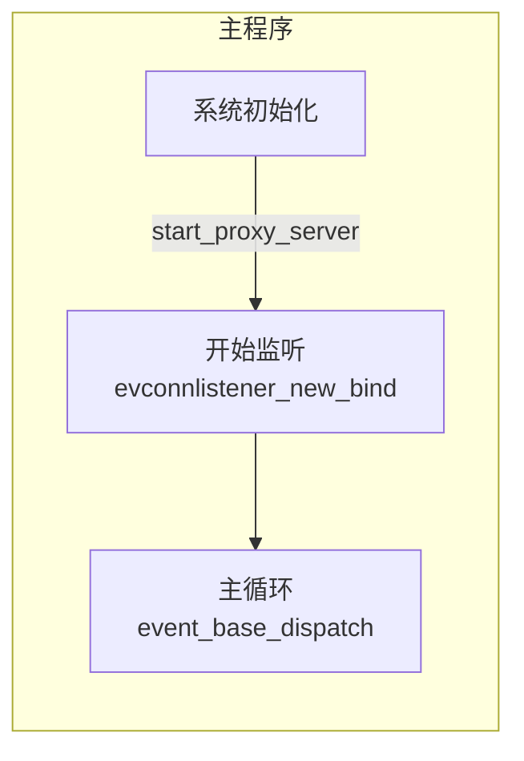
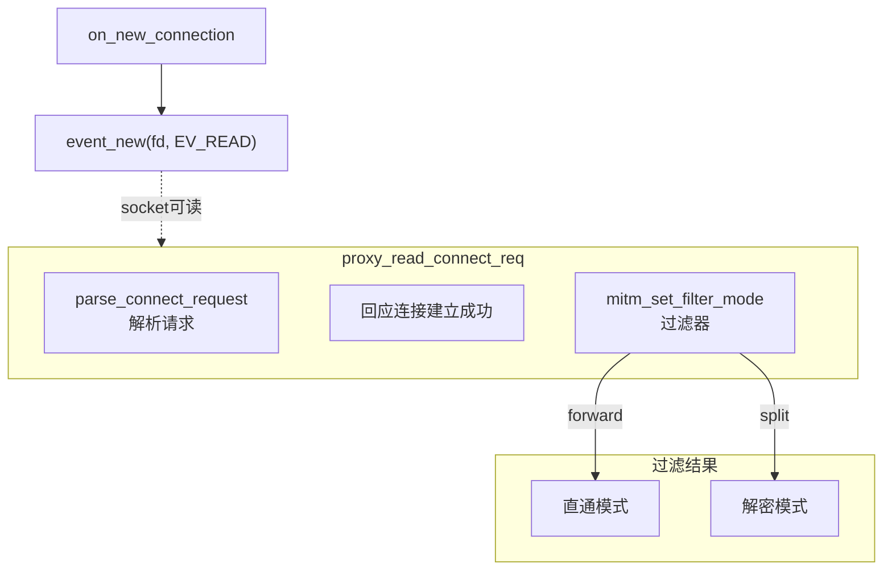
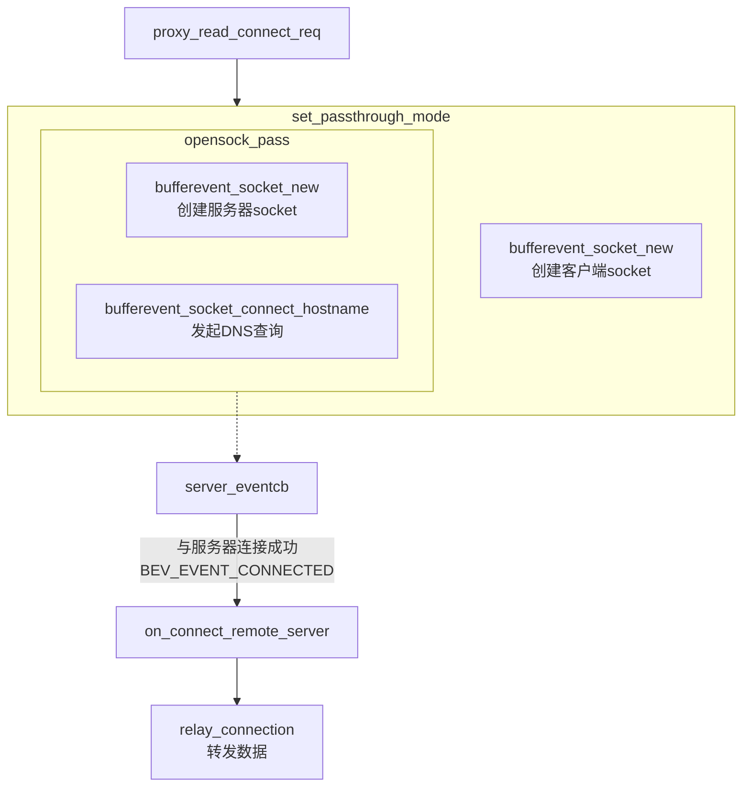
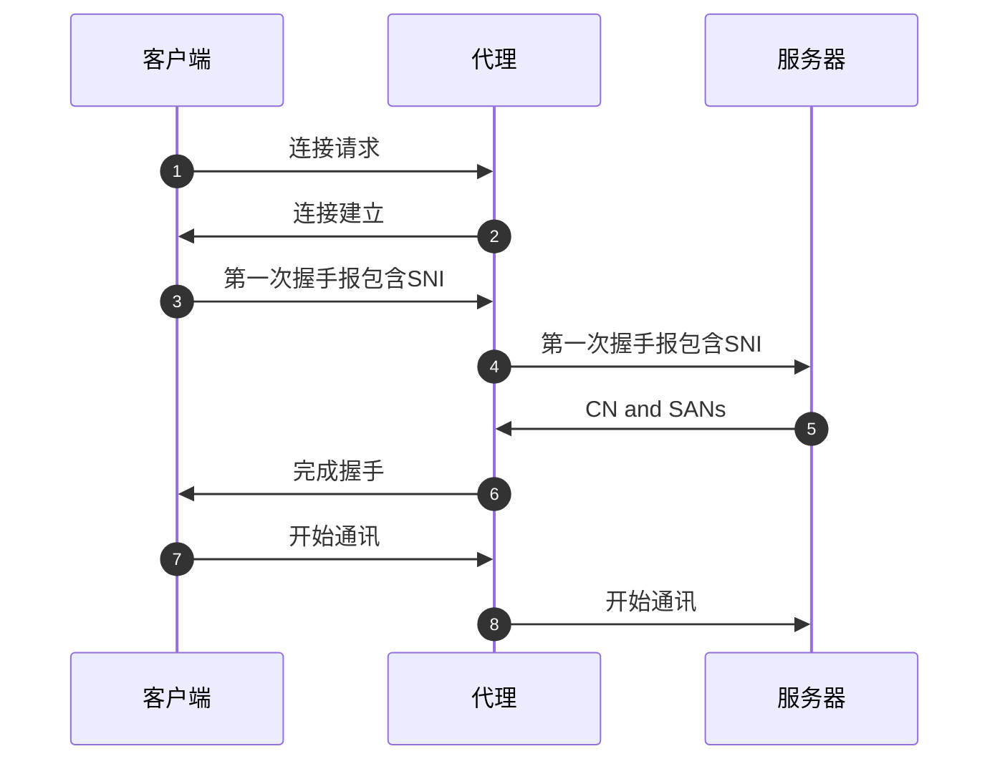
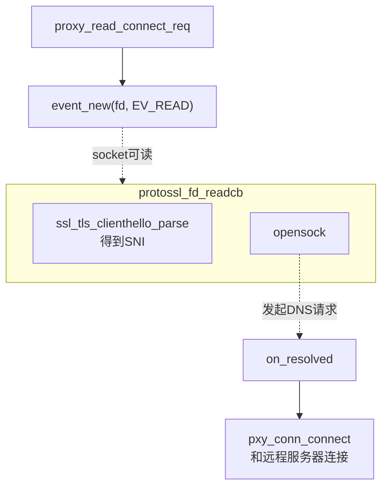
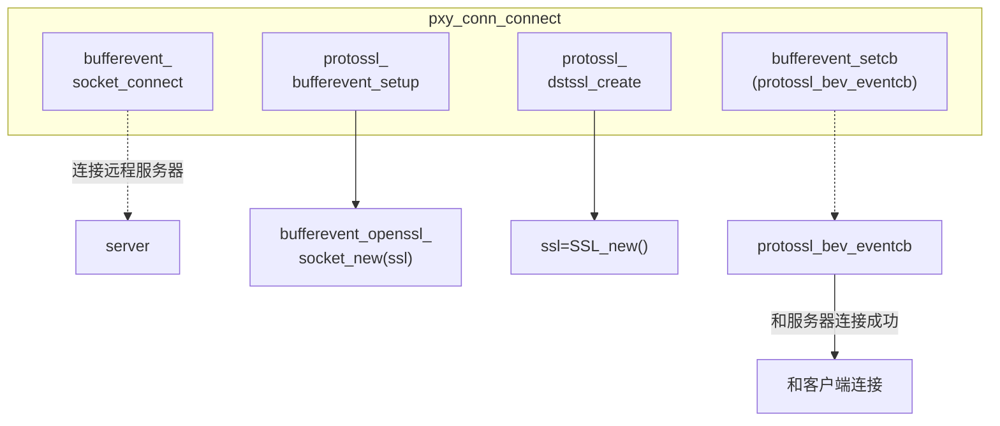
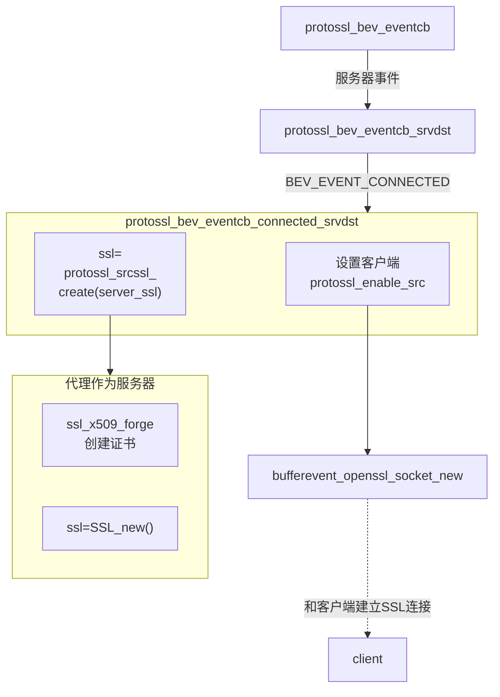

# mitm-3-mitm实现1-总体架构

2025/12/9 写

现在开始讲解 MITM代理是如何实现的。

本文只讲解总体架构。


# 工作模式


## 2种模式

有2种工作模式：

1. forward 直通模式：MITM 直接转发数据，不解密。和 http/https 代理一样。
2. mitm 解密模式：MITM 可能会解密，还取决于过滤系统。

```c
enum WORK_MODE {
    WORK_MODE_FORWARD = 0, //HTTPS proxy
    WORK_MODE_MITM //mitm proxy
};
```


## 总框架图

如果工作模式设置为 **WORK_MODE_FORWARD**，则系统相当于 http/https 代理，只转发，而不关心内容。

工作原理如下：




如果工作模式设置为**WORK_MODE_MITM**，则系统工作在 mitm 代理模式，将会解密 HTTPs 流量。

类似 mitmdump。工作原理如下：




## 过滤器 filter

用户注册一个过滤器，可以只解密关心的网络连接。

```c
enum FILTER_RESULT {
    FILTER_RESULT_PASS = 0, //forward only
    FILTER_RESULT_SPLIT, //decrypt https traffic
};
```

如果过滤器返回 FILTER_RESULT_PASS， 则这个https 连接不解密，采用直通模式；

如果过滤器返回 FILTER_RESULT_SPLIT，则解密这个https 连接。

```c
typedef enum FILTER_RESULT (*cbfilter_by_host)(const char* host_name);
void register_filter_cb_host(mitm_ctx* ctx, cbfilter_by_host cbfunc);

void mitm_set_filter_mode(struct child* pchild)
{
	struct mitm_ctx_st* ctx = pchild->mctx;
	enum FILTER_RESULT res = DEFAULT_FILTER_RESULT;

	//is CONNECT?
	int is_https = 1;
	if (strcasecmp(pchild->req.method, "connect")) {
		is_https = 0;
	}	

	if (ctx->mode == WORK_MODE_FORWARD) {
		res = FILTER_RESULT_PASS;
	} else if (!is_https) {
		// only care https
		res = FILTER_RESULT_PASS;
	} else {
		//mode is WORK_MODE_MITM, and is CONNECT request
		if (ctx->cb_host)
			res = ctx->cb_host(pchild->req.host);
	}

	pchild->filter_res = res;
}
```

流程图如下：




# 工作流程


## 注意

由于许多函数调用是异步的（libevent 实现的异步功能），所以程序看着比较复杂。

以下的框图中：

**虚线**代表异步调用；**实线**代表同步调用

特别注意虚线连接。


## 1 - 初始化

```c
mitm_ctx* mitm_init(char* ip, unsigned short port);

//例如绑定本地 127.0.0.1:8080
mitm_ctx* mitm = mitm_init("127.0.0.1", 8080);
```

初始化需要两个参数：代理绑定的IP地址和端口。

mitm_init 做了如下几件事：

1. 设置windows 全局代理
2. 加载 CA 证书和 CA 私钥
3. 初始化 Windows Winsock 环境
4. 初始化 libevent
5. 设置  SIGINT (ctrl-c) 处理函数




## 2 - 处理客户端连接

当接收到客户端连接请求后：



这里为什么用 event_new 监听客户端请求，而不是直接调用 bufferevent_socket_new 来监听客户端请求？

因为这时还不知道用直通模式还是解密模式。

确定模式后（调用 mitm_set_filter_mode 函数后），才能创建  bufferevent 。

直通模式：**bufferevent_socket_new**，建立TCP 连接；无需解密，直接转发数据

解密模式： **bufferevent_openssl_socket_new**，建立SSL 连接；可以解密https


## 3 - 直通模式





## 4 - 解密模式

先来一个 TLS 握手阶段的示意图：



当 proxy_read_connect_req 执行完毕时，已经完成了第1步和第2步。

现在准备处理第3步到第6步。



**和服务器连接**

代理作为客户端，和远程服务器连接




**和客户端连接**

代理作为服务器，和客户端连接。

```c
bufferevent_setcb(ctx->conn.server_socket, NULL, NULL, protossl_bev_eventcb, ctx);
```

当和远程服务器建立连接后，会调用 protossl_bev_eventcb




# 下一步

直通模式下：代理分别和客户端和服务器端建立了 **TCP 连接**，直接转发数据，无需加密和解密；

解密模式下：代理分别和客户端和服务器端建立了 **SSL 连接**。

那么，代理是如何加密和解密呢？

下一篇文章讲解。

