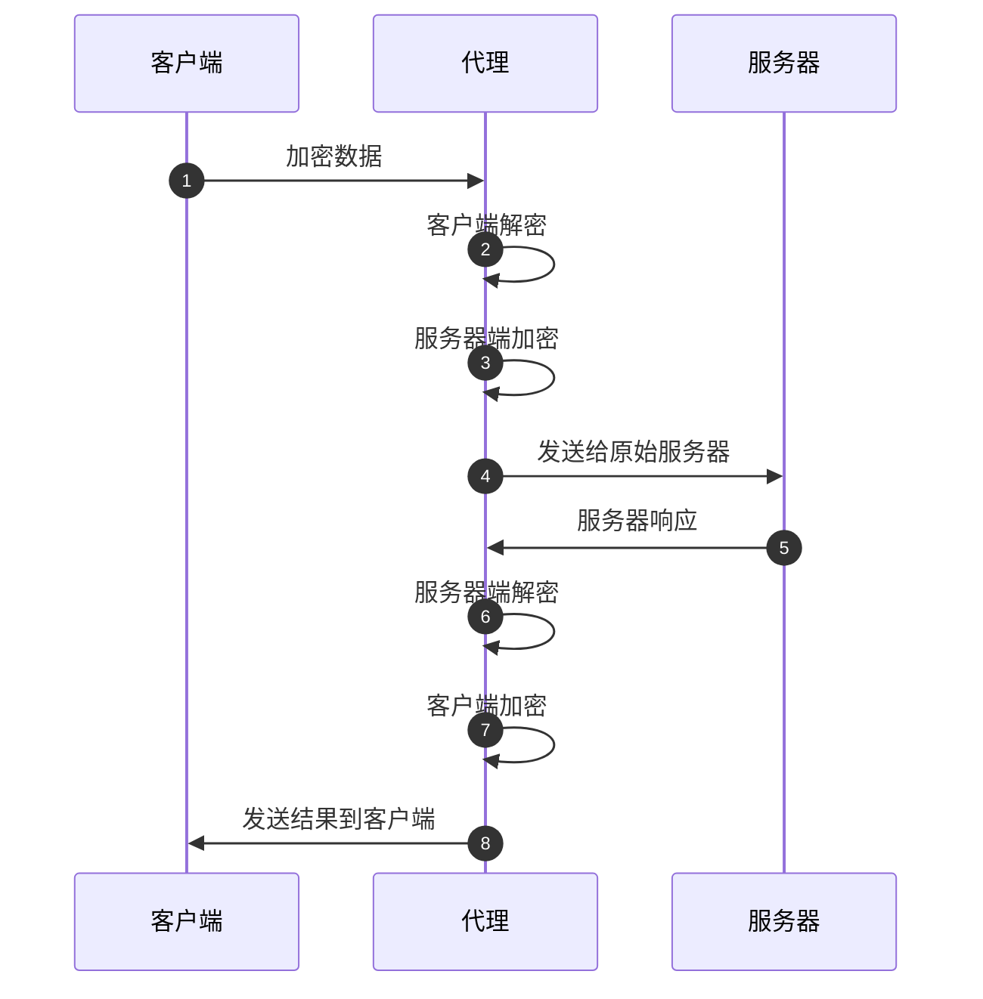
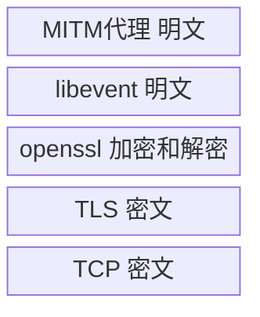

# mitm-4-mitm实现2-破解https

2025/12/16 写

上一篇文章讲述了 MITM 的总体架构。

MITM 用于解密 HTTPs，本文介绍如何解密。


答案：无需解密

为什么？

因为有libevent 这个大杀器。

所以，本文重点讲解 libevent。


# MITM 原理

以下是 MITM 工作流程：



注意，上图中，代理需要不断的加密和解密。

因为客户端和服务器端的通讯是加密的。

代理和客户端通讯用的密钥，代理和服务器端通讯用的密钥，两个密钥是不同的。

代理同时知道两个密钥，所以可以加密和解密。

在当前的 MITM 实现中，如何体现加密和解密呢？


# 1 - 准备 SSL 连接

一般情况下，客户端（比如浏览器）发起 SSL 连接。

第一个握手包是 **ClientHello**。

此时，已经知道服务器的主机名称和端口地址，例如：

```http
CONNECT channels.weixin.qq.com:443 HTTP/1.1\r\n
```

客户端向服务器发送连接请求前，先向代理服务器发送 CONNECT 请求，代理服务器就知道

主机名：channels.weixin.qq.com

端口：443

然后代理就会试图解析这个主机名，这需要DNS 服务：从主机名到IP地址。

代码用 opensock 函数实现这个功能。

```c
int opensock(struct child* pchild, const char* host, int port)
{
	struct conn_s* connptr = &pchild->conn;
	struct event_base* base = pchild->mctx->base;

	connptr->port = port;
	connptr->dns_base = evdns_base_new(base, 1);

	struct evutil_addrinfo hints;
	memset(&hints, 0, sizeof(hints));
	hints.ai_family = AF_INET;
	hints.ai_flags = EVUTIL_AI_CANONNAME;
	hints.ai_socktype = SOCK_STREAM;
	hints.ai_protocol = IPPROTO_TCP;

	struct evdns_getaddrinfo_request* req = evdns_getaddrinfo(
		connptr->dns_base, host, NULL,
		&hints, on_resolved, (void*)pchild);

	return 0;
}
```

注意，这里是一个异步调用，当完成 DNS 查询时，会调用 on_resolved 回调函数。

```c
void on_resolved(int errcode, struct evutil_addrinfo* addr, void* ptr)
{
    struct child* pchild = (struct child*)ptr;
    
    //use first ip
    struct evutil_addrinfo* ai = addr;
    struct sockaddr_in* sin = (struct sockaddr_in*)ai->ai_addr;
    char ip_str[128];
    evutil_inet_ntop(AF_INET, &sin->sin_addr, ip_str, 128);
    strcpy(pchild->sslctx->server_ip, ip_str);
    
    //clean
    evutil_freeaddrinfo(addr);
    evdns_base_free(pchild->conn.dns_base, 0);
    pchild->conn.dns_base = NULL;
    
    //here, DNS query finished, try to connect with remote server
	pxy_conn_connect(pchild);
}
```

这里，完成了 DNS 查询，得到服务器 IP，保存在 pchild->sslctx->server_ip，代理可以连接服务器了。

pxy_conn_connect 完成这个功能。


# 2 - 和服务器握手

pxy_conn_connect 完成代理和服务器的TLS 握手。

```c
void pxy_conn_connect(struct child* pchild)
{
    server_ssl = protossl_dstssl_create(pchild);
    server_socket = protossl_bufferevent_setup(pchild, -1, connptr->server_ssl);
    bufferevent_setcb(server_socket, NULL, NULL, protossl_bev_eventcb, pchild);
    //connect with remote server, trigger the SSL handshake
    struct sockaddr_in sin;
    init_sockaddr_in(&sin, pchild->sslctx->server_ip, connptr->port);
    bufferevent_socket_connect(server,
        (struct sockaddr*)&sin, sizeof(struct sockaddr_in));
}

//这里创建 openssl SSL 连接上下文
SSL* protossl_dstssl_create(struct child* ctx)
{
    const SSL_METHOD* method = TLS_method();
    sslctx = SSL_CTX_new(method);
    protossl_sslctx_setoptions(sslctx, ctx); //设置SSL 连接参数
    SSL_CTX_set_verify(sslctx, SSL_VERIFY_NONE, NULL);
    ssl = SSL_new(sslctx);
	SSL_CTX_free(sslctx);
    if (ctx->sslctx->sni) {
		SSL_set_tlsext_host_name(ssl, ctx->sslctx->sni);
	}
    SSL_set_mode(ssl, SSL_get_mode(ssl) | SSL_MODE_RELEASE_BUFFERS);
    return ssl;
}

struct bufferevent* 
protossl_bufferevent_setup(struct child* ctx, evutil_socket_t fd, SSL* ssl)
{
    struct bufferevent* bev = bufferevent_openssl_socket_new(base, fd, ssl,
		((fd == -1) ? BUFFEREVENT_SSL_CONNECTING : BUFFEREVENT_SSL_ACCEPTING), BEV_OPT_DEFER_CALLBACKS);
    return bev;
}
```

代理作为客户端，bufferevent_socket_connect 触发和远程服务器 TLS 握手。

[Bufferevents: advanced topics](https://libevent.org/libevent-book/Ref6a_advanced_bufferevents.html)

代理作为客户端，fd = -1, 所以，

```c
enum bufferevent_ssl_state {
	BUFFEREVENT_SSL_OPEN = 0,
	BUFFEREVENT_SSL_CONNECTING = 1,
	BUFFEREVENT_SSL_ACCEPTING = 2
};

server = bufferevent_openssl_socket_new(base, -1, ssl, 
           		BUFFEREVENT_SSL_CONNECTING, BEV_OPT_DEFER_CALLBACKS);
```

The state should be **BUFFEREVENT_SSL_CONNECTING** if the SSL is currently performing negotiation as a client, **BUFFEREVENT_SSL_ACCEPTING** if the SSL is currently performing negotiation as a server, 

or BUFFEREVENT_SSL_OPEN if the SSL handshake is done.


何时完成握手呢？

TLS握手是Openssl 自动完成的，当完成握手时，libevent 会调用 protossl_bev_eventcb 函数：

并且event事件是 **BEV_EVENT_CONNECTED**，即完成握手。

```c
void protossl_bev_eventcb(struct bufferevent* bev, short events, void* arg)
{
    struct child* ctx = (struct child*)arg;
    if (events & BEV_EVENT_CONNECTED) {
        protossl_bev_eventcb_srvdst(bev, events, ctx);
    }
}
```

到这里，代理和服务器的连接已经完成。

接下来，代理将会和客户端进行 TLS 握手。

protossl_bev_eventcb_srvdst 调用 protossl_bev_eventcb_connected_srvdst，这个函数用来设置和客户端的TLS 连接。


# 3 - 和客户端握手

代理作为服务器，如何触发和客户端的 SSL握手？何时完成握手？

protossl_bev_eventcb_connected_srvdst 用来设置和客户端的TLS 连接。

```c
protossl_bev_eventcb_connected_srvdst(struct bufferevent* bev, struct child* ctx)
{
	struct conn_s* connptr = &ctx->conn;
	connptr->client_ssl = protossl_srcssl_create(ctx, connptr->server_ssl);

	struct bufferevent* server = connptr->server_socket;
	bufferevent_setcb(server, protohttp_bev_readcb, protohttp_bev_writecb, protossl_bev_eventcb, ctx);
	bufferevent_enable(server, EV_READ | EV_WRITE);
	protossl_enable_src(ctx);
}

static SSL* protossl_srcssl_create(struct child* ctx, SSL* origssl)
{
	ctx->sslctx->origcrt = SSL_get_peer_certificate(origssl);
	X509* cert = protossl_srccert_create(ctx);

	SSL_CTX* sslctx = protossl_srcsslctx_create(ctx, cert, ctx->mctx->leafkey);
	X509_free(cert);
	SSL* ssl = SSL_new(sslctx);
	SSL_CTX_free(sslctx);

	/* lower memory footprint for idle connections */
	SSL_set_mode(ssl, SSL_get_mode(ssl) | SSL_MODE_RELEASE_BUFFERS);
	return ssl;
}

int protossl_enable_src(struct child* ctx)
{
	struct conn_s* connptr = &ctx->conn;
	client = protossl_bufferevent_setup(ctx, connptr->fd, connptr->client_ssl);
	bufferevent_setcb(client, protohttp_bev_readcb, protohttp_bev_writecb, protossl_bev_eventcb, ctx);
	bufferevent_enable(client, EV_READ | EV_WRITE);
	return 0;
}
```

protossl_srcssl_create 是最重要的函数。

因为代理已经和服务器建立连接，所以服务器已经把原始证书发给了代理。

origcrt = SSL_get_peer_certificate(origssl);

origcrt 就是原始证书。

X509* cert = protossl_srccert_create();

protossl_srccert_create 根据原始证书，开始伪造证书，伪造的证书将发给客户端（比如浏览器）。

一旦完成伪造的证书，就可以建立客户端的 TLS 连接上下文，进而创造客户端的 bufferevent socket。

```c
//代理作为客户端，和服务器连接, fd = -1
bufferevent_openssl_socket_new(base, -1, ssl, 
           		BUFFEREVENT_SSL_CONNECTING, BEV_OPT_DEFER_CALLBACKS);

//代理作为服务器，和客户端连接 bufferevent socket, fd 的值有效
bufferevent_openssl_socket_new(base, fd, ssl, 
           		BUFFEREVENT_SSL_ACCEPTING, BEV_OPT_DEFER_CALLBACKS);
```

一旦代理调用 bufferevent_openssl_socket_new， libevent 就会自动和客户端开始 TLS 握手。

同样的，握手完成后，会调用 protossl_bev_eventcb，并且 event事件是 **BEV_EVENT_CONNECTED**，即完成握手。


# 4 - 破解 https

到了这里，已经建立了2个 TLS 连接。

分别是：代理和客户端，代理和服务器。

那么，如何破解客户端和服务器端的 https 通讯呢？

前面做了那么多复杂的事情，好像没有破解相关的工作，真的是这样吗？

我们**已经完成了破解**，现在，代理得到的数据是**明文**。

什么？完成破解了？

没有得到客户端或服务器端的私钥，怎么计算会话密钥呢？

不计算会话密钥，怎么能破解 https 通讯呢？

答案：

libevent 封装了 OpenSSL，OpenSSL 替你做了这一切。


代理作为客户端，和服务器创建 TLS 连接：

```c
server_ssl = protossl_dstssl_create(pchild);
server_socket = bufferevent_openssl_socket_new(base, -1, server_ssl, 
           		BUFFEREVENT_SSL_CONNECTING, BEV_OPT_DEFER_CALLBACKS);
bufferevent_socket_connect(server, &sin, ...);
```

bufferevent_socket_connect 触发和服务器的连接。


代理作为服务器，和客户端创建 TLS 连接：

```c
client_ssl = protossl_srcssl_create(ctx, connptr->server_ssl);
client_socket = bufferevent_openssl_socket_new(base, fd, ssl, 
           		BUFFEREVENT_SSL_ACCEPTING, BEV_OPT_DEFER_CALLBACKS);
```

bufferevent_openssl_socket_new 触发和客户端的连接。

一旦 TLS 连接建立，OpenSSL 用自己的私钥，就可以计算出会话密钥，然后解密 https，

把解密后的数据传给 libevent， libevent 把明文传给代理。


关系如下：




# 5 - 转发数据

建立 TLS 连接后，如何转发数据？

即把客户端的数据转发给服务器；服务器的数据转发给客户端，下一篇文章将会讲解。


# 总结

因为有libevent 封装了 OpenSSL 开源库，所以 MITM 的实现大为简化。

libevent 提供给 MITM 的数据，就是解密的（OpenSSL 负责加密和解密）；

MITM 传给 libevent 的数据，libevent 内部会调用 OpenSSL ，加密后再发送给对方。

一切都很完美。

下一篇文章，讲解如何生成假证书。

证书：让客户端（一般指的是浏览器）相信代理是真的服务器，如何做到这一点，请听下回分解。