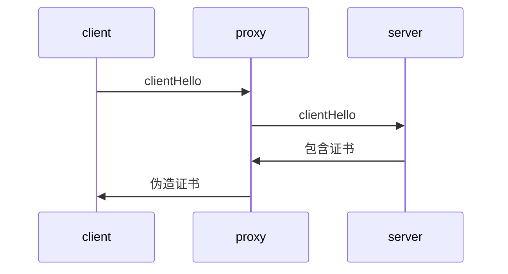

# mitm-5-mitm实现3-假证书

2025/12/21 写

备注：代码已经完成，正在整理中，近期将上传到码云和 GitHub 上。

现在正在完善文档，本文是文档的一部分。


# 前言

之前的文章， 已经描述了 MITM 代理如何破解 https 流量。

这其中很关键的一环，是伪造证书，本文就讲述这一关键步骤。


源代码中有一个示例：sample.c，演示了如何修改网页。

示例程序启动前，访问“雪球网站”，


当示例程序启动后，访问同一个网站：


用证书查看器，可以看到，原来的证书颁发者：**RapidSSL**

而修改后的证书颁发者：**albert-CA**，这是如何做到的？

------

# 时机

客户端和服务器建立连接的过程中，何时替换证书？



代理从服务器得到真证书后，上例中，就是 RapidSSL 颁发的证书；

代理就修改其内容，制作假证书，然后发给客户端。


# 证书的作用

证书相当于身份证，证明网站的合法性。

证书中包含两个信息：

证书签名，是一个 2048位（256字节）的字符串，是用 CA 私钥生成的。

证书公钥，是一个 2048位（256字节）的字符串，用于生成握手签名值。


证书签名 VS 握手签名

| 签名分类 | 用途       | 填充算法         | 签名所需密钥 | 验证所需密钥 |
| -------- | ---------- | ---------------- | ------------ | ------------ |
| 证书签名 | 证书合法性 | RSAES-PKCS1-v1_5 | CA 私钥      | CA公钥       |
| 握手签名 | 网站合法性 | RSASSA-PSS       | 证书私钥     | 证书公钥     |

更详细的解释，请看以下文章：

[openssl-12-https证书1-解析证书 - 知乎](https://zhuanlan.zhihu.com/p/1968215676352169633)

[openssl-13-https证书2-证书签名 - 知乎](https://zhuanlan.zhihu.com/p/1968534610733433649)

[openssl-14-https证书3-握手签名 - 知乎](https://zhuanlan.zhihu.com/p/1968888032124991128)


证书中的公钥信息如下；

```t
Subject Public Key Info:
            Public Key Algorithm: rsaEncryption
                Public-Key: (2048 bit)
                Modulus:
                    00:94:d9:59:d3:a3:05:a7:80:c4:5e:b0:d2:dc:fd:
                    34:88:c0:c3:37:16:9f:4b:d8:8d:ff:61:f8:76:76:
                    79:8e:50:03:20:9c:65:76:69:d8:1e:7f:7c:b5:2f:
                    e7:92:6d:aa:a4:cd:dc:ee:23:ac:36:3c:c8:c6:3a:
                    22:af:6a:0c:3d:03:20:22:97:3b:51:89:8d:6b:62:
                    fa:4b:d9:20:31:a3:11:a9:53:3b:46:fd:c0:7f:11:
                    fc:8c:5e:e5:cf:3e:4e:97:6d:58:e5:91:4c:ae:2b:
                    53:b4:93:37:a2:fb:14:d0:a9:f5:35:2a:6b:01:40:
                    f7:68:71:73:6d:fd:c8:fa:be:57:43:78:a9:fe:47:
                    16:a2:0b:6a:85:f7:98:ad:ba:df:08:23:42:13:30:
                    8c:8e:cb:26:c8:85:e3:10:2c:61:92:31:8d:0e:77:
                    b6:f0:78:a3:46:c5:ab:99:01:7e:25:03:0f:9b:58:
                    32:36:4b:1d:8e:05:57:45:b3:3d:17:84:d9:c0:29:
                    7c:6f:11:80:5b:4b:56:bf:46:47:c6:6a:16:3f:dd:
                    f7:2d:0f:c1:5c:10:77:0e:b7:cb:1c:b9:09:d8:ff:
                    32:b9:c5:2a:9f:68:66:c5:fb:b0:0e:7d:76:2d:65:
                    53:10:dc:46:5b:cc:1b:cb:42:39:17:60:6d:e4:dc:
                    58:05
                Exponent: 65537 (0x10001)
```


证书中的签名值如下：

```
Signature Algorithm: sha256WithRSAEncryption
    Signature Value:
        99:1e:1e:39:ee:96:4c:c7:62:f2:9b:ec:3d:f1:1b:e9:14:79:
        e9:97:b5:33:ce:8f:3a:cb:cd:df:db:04:66:8b:c8:2a:63:87:
        ce:02:74:af:e6:da:8d:44:78:2e:e5:20:67:50:8f:62:d1:88:
        b0:0e:0f:39:60:7f:7c:57:ee:d9:f3:61:ad:58:a3:7b:d5:db:
        bc:c7:45:1a:23:db:4d:56:4c:5f:be:89:31:ad:e6:3b:a3:67:
        9e:5b:52:a9:db:7b:9c:71:84:73:0e:82:cd:ee:b1:ad:18:e6:
        f8:dc:e4:37:c3:3d:55:76:13:4c:0b:0f:da:68:f8:bc:3c:f4:
        ac:66:55:57:ef:0e:f9:d3:36:43:31:e7:09:09:2b:71:46:83:
        24:30:5b:49:cf:14:44:0f:ab:db:9a:c9:d4:52:14:78:ff:5f:
        0e:b3:06:ef:46:b4:44:52:cd:24:81:88:7c:87:3b:19:c0:66:
        18:4b:6e:c3:97:81:1b:a2:f1:3d:74:12:a1:e8:ee:18:2d:f8:
        26:44:ee:47:0f:43:fa:37:36:82:d1:a1:20:ca:9f:95:b2:1a:
        56:24:93:2c:6c:d9:d0:75:0f:f1:03:a3:bd:b5:cb:81:ce:2d:
        a3:1e:8a:88:b4:48:aa:eb:38:a9:b7:73:2c:af:2b:71:6a:e5:
        90:27:57:93
```

以下开始讲具体实现。


# 准备参数

当代理和服务器完成 TLS 握手之后，代理就得到了原始证书。

然后，程序调用 protossl_bev_eventcb_connected_srvdst，

这个函数会调用 protossl_srcssl_create 建立客户端的 SSL 上下文。

```c
SSL* protossl_srcssl_create(struct child* ctx, SSL* origssl)
{
    origcrt = SSL_get_peer_certificate(origssl);
	X509* cert = protossl_srccert_create(origcrt);

    SSL_CTX* sslctx = protossl_srcsslctx_create(ctx, cert, ctx->mctx->leafkey);
    X509_free(cert);
    SSL* ssl = SSL_new(sslctx);
    SSL_CTX_free(sslctx);
    return ssl;
}
```

origssl 就是与服务器建立连接后的 SSL 上下文，从中得到原始证书。

然后根据原始证书 origcrt，生成假证书 cert。

```c
protossl_srccert_create()
{
	cert = ssl_x509_forge(mctx->cacrt, mctx->cakey,
		ctx->sslctx->origcrt, mctx->leafkey);
}
```

cacrt：CA 证书

cakey：CA 私钥

leafkey 是什么？CA 证书和CA 私钥怎么来的？

leafkey 就是证书私钥，用于生成证书公钥。这是程序动态生成的，每次都不一样。

```c
leafkey = EVP_RSA_gen(2048);
```


CA证书和CA 私钥，是用openssl 命令生成的， 这是固定的。

这是自签名证书，CA证书需要安装到win10 操作系统中： **受信任的根证书颁发机构**

只需要一句话，就可以同时生成2个文件；RootCA.key,  RootCA.crt

```bash
openssl req -x509 -nodes -new -sha256 -days 1024 -newkey rsa:2048 -keyout RootCA.key -out RootCA.crt -subj "/C=CN/CN=albert-CA"
```

然后，用 openssl 函数可以加载这两个文件：

```c
X509* get_cert(const char* path)
{
	BIO* bio = BIO_new_file(path, "r");
	if (!bio)
		return NULL;
	X509* x = PEM_read_bio_X509(bio, NULL, NULL, NULL);
	BIO_free(bio);
	return x;
}

EVP_PKEY* rsa_get_key_fromfile(const char* filename)
{
    BIO* bio = BIO_new_file(filename, "r");
    pkey = PEM_read_bio_PrivateKey(bio, NULL, NULL, NULL);
    BIO_free(bio);
	return pkey;
}

cacrt = get_cert("RootCA.crt");
cakey = rsa_get_key_fromfile("RootCA.key,");
```

有了CA证书，CA 私钥，证书私钥，原始证书，就可以伪造证书了。


# 伪造证书

就是调用 Openssl 的证书操作函数。

本质：从原始证书提取有效信息，填充到伪造证书中。

然后替换证书签名和证书公钥。

```c
X509* ssl_x509_forge(X509* cacrt, EVP_PKEY* cakey, X509* origcrt, EVP_PKEY* key)
{
    //Subject: CN=albert
	X509_NAME* subject = X509_get_subject_name(origcrt);
	//Issuer: CN=albert-CA
	X509_NAME* issuer = X509_get_subject_name(cacrt);
    
    crt = X509_new();
    X509_set_version(crt, 0x02);
    X509_set_subject_name(crt, subject);
    X509_set_issuer_name(crt, issuer);
    ssl_x509_serial_copyrand(crt, origcrt);
    
    ASN1_TIME* notbefore = X509_getm_notBefore(origcrt);
	ASN1_TIME* notafter = X509_getm_notAfter(origcrt);
    X509_set1_notBefore(crt, notbefore);
    X509_set1_notAfter(crt, notafter);
    
    //设置SSL的证书私钥，就可以生成证书公钥
    X509_set_pubkey(crt, key);
    
    //设置CA 证书
    X509V3_CTX ctx;
	X509V3_set_ctx(&ctx, cacrt, crt, NULL, NULL, 0);
    
    //得到原始证书的哈希算法，比如 md = SHA256
    int pkey_type = EVP_PKEY_type(EVP_PKEY_base_id(cakey));
	int sig_nid = X509_get_signature_nid(origcrt);
	const EVP_MD* md = get_cert_md(pkey_type, sig_nid);
    
    //参数初始化完毕，用CA私钥 cakey签名
    X509_sign(crt, cakey, md);
    
    return crt;
}
```


# 总结

到这里，假证书制作完毕，代理就可以和客户端完成 TLS 握手。

一旦代理和服务器，客户端完成 TLS 握手。

那么，代理就完成了 https 的破解工作。应用层就可以得到破解后的明文。

下一步，应用层不仅想破解 https，还想改变 https 的内容，这是如何做到的？

下一篇文章讲述：

如何修改 https 的内容？

专业术语：https inject ，即 https 注入。

**“HTTPS注入”本身不是一个合法的、常规的网络操作**。它是一个统称，指的是一类**网络攻击或恶意监控技术**，其核心目标是**突破或绕过HTTPS协议提供的加密保护，窥探或篡改本应安全的通信内容**。

就如同示例代码做的，本来雪球网显示的内容，被改成 **hello world**，如何做到这一点？
