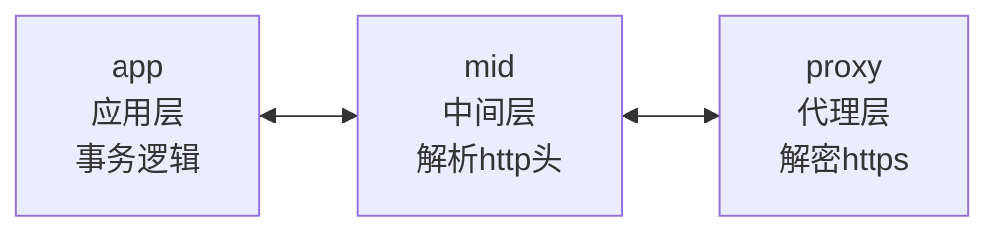
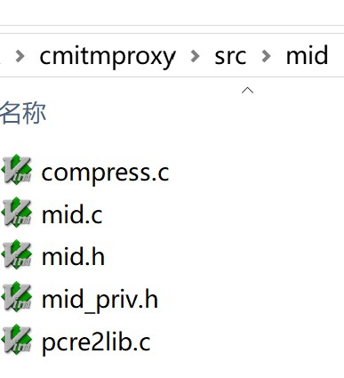
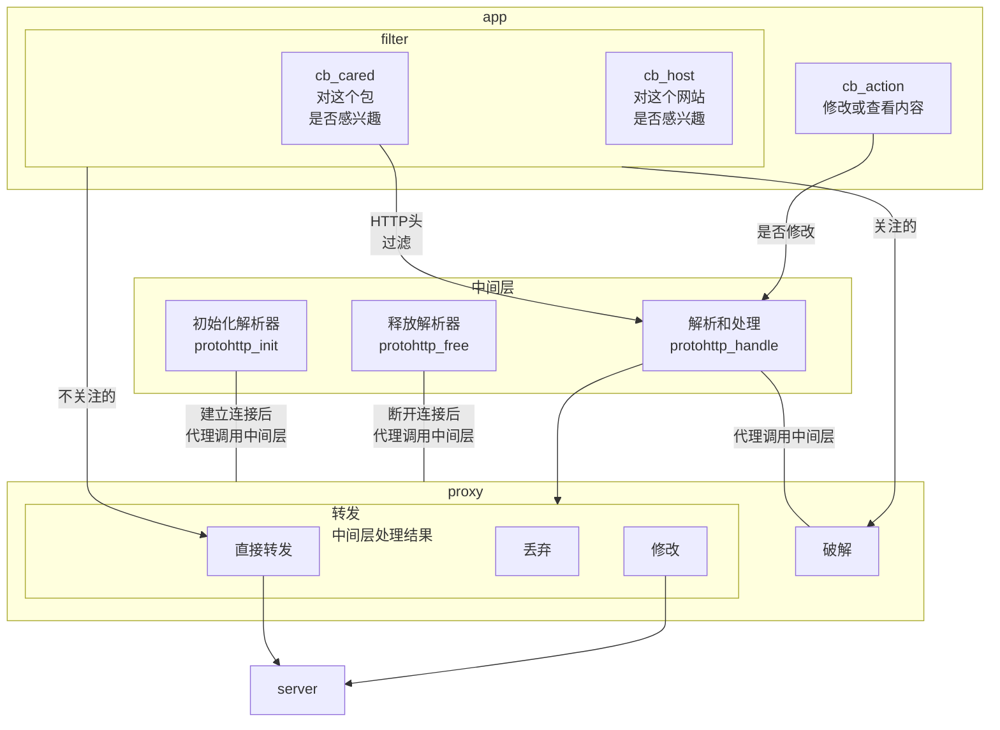

# mitm-6-mitm实现4-中间层

2025/12/23 写

Man-in-the-Middle Attack

MITM：c语言实现的，破解 https 流量


花了一周时间，把代码整理了一下，抽象出中间层 mid。

这样做，架构清晰，扩展性强。


# 缘起

为什么需要中间层？

本来只划分了2层。

应用层：只负责**事务逻辑**，Transaction Logic

代理层：只负责**破解** https 流量，crack https


代理层设计原则：

- 尽可能简洁
- 只负责加密和解密
- 其它逻辑尽量放在应用层：例如过滤，解析http等


应用层的设计原则：

- 不关心底层实现
- 只负责事务逻辑


实际开发过程中，发现有一大块内容，不知道应该放在哪一层。

代理破解了 https 流量之后，解析 HTTP 头，组装 HTTP 内容，压缩和解压等工作，谁来做？

## 1 - 解析http 头

举一个示例，当客户端访问web 服务器时，会发生以下通讯：

```http
Hypertext Transfer Protocol
    GET / HTTP/1.1\r\n
    Host: localhost\r\n
    User-Agent: curl/8.13.0\r\n
    Accept: */*\r\n
    \r\n
    [Response in frame: 39]
    [Full request URI: https://localhost/]
```

以上是一个 HTTP request header，至少需要解析出以下重要信息：

HTTP 方法：GET

HTTP 版本：1.1

HTTP URI：/

host：localhost


```http
Hypertext Transfer Protocol
    HTTP/1.1 200 OK\r\n
    Server: nginx/1.28.0\r\n
    Date: Wed, 03 Dec 2025 01:35:04 GMT\r\n
    Content-Type: text/html\r\n
    Content-Length: 615\r\n
    Last-Modified: Wed, 23 Apr 2025 11:48:54 GMT\r\n
    Connection: keep-alive\r\n
    ETag: "6808d3a6-267"\r\n
    Strict-Transport-Security: max-age=63072000\r\n
    X-Frame-Options: DENY\r\n
    X-Content-Type-Options: nosniff\r\n
    X-XSS-Protection: 1; mode=block\r\n
    Accept-Ranges: bytes\r\n
    \r\n
    [Request in frame: 35]
    [Time since request: 483.000 microseconds]
    [Request URI: /]
    [Full request URI: https://localhost/]
    File Data: 615 bytes
```

以上是一个 HTTP response header，至少需要解析出以下重要信息：

status code: 200

Content-Type: text/html

Content-Length: 615

解析完成之后，html 内容，上面例子中，是 615字节的文本内容（text/html），就方便处理了。

**解析 HTTP** ，应该谁来做，应用层还是代理层？


## 2 - 组装 HTTP

客户端访问一个网页，如果网页内容很多，http 服务器会发送多次，才能把一个网页内容发送给客户端。

例如：下面是一个 HTTP 响应， TLS层 组装了10个包，一共 131769 字节。

```
Transport Layer Security
[10 Reassembled TLS segments (131769 bytes): #2561(446), #2579(16384), #2597(16384), #2613(16384), #2635(16384), #2653(16384), #2670(16384), #2688(16384), #2704(16384), #2706(251)]
    [Frame: 2561, payload: 0-445 (446 bytes)]
    [Frame: 2579, payload: 446-16829 (16384 bytes)]
    [Frame: 2597, payload: 16830-33213 (16384 bytes)]
    [Frame: 2613, payload: 33214-49597 (16384 bytes)]
    [Frame: 2635, payload: 49598-65981 (16384 bytes)]
    [Frame: 2653, payload: 65982-82365 (16384 bytes)]
    [Frame: 2670, payload: 82366-98749 (16384 bytes)]
    [Frame: 2688, payload: 98750-115133 (16384 bytes)]
    [Frame: 2704, payload: 115134-131517 (16384 bytes)]
    [Frame: 2706, payload: 131518-131768 (251 bytes)]
    [Segment count: 10]
    [Reassembled PDU length: 131769]
    [Reassembled PDU data […]: 
```

TLS 组装之后，最终显示的 HTTP 头：

```http
Hypertext Transfer Protocol
    HTTP/1.1 200 OK\r\n
    Last-Modified: Wed, 10 Dec 2025 08:22:45 GMT\r\n
    Content-Encoding: br\r\n
    Etag: "761f3b295fd4ccbf0d7ad709de881fd3"\r\n
    Content-Type: application/javascript\r\n
    Content-Length: 131323\r\n
    Accept-Ranges: bytes\r\n
    X-NWS-LOG-UUID: 8530997749576461560\r\n
    Connection: keep-alive\r\n
    Server: Lego Server\r\n
    Date: Wed, 10 Dec 2025 20:14:25 GMT\r\n
    X-Cache-Lookup: Cache Refresh Hit\r\n
    Vary: Origin\r\n
    Cache-Control: max-age=31536000\r\n
    Access-Control-Allow-Origin: *\r\n
    \r\n
    [Request in frame: 2323]
    [Time since request: 201.364000 milliseconds]
    [Request URI: /t/wx_fed/finder/web/web-finder/res/js/virtual_svg-icons-register.publishDJmRcesj.js]
    [Full request URI: https://res.wx.qq.com/t/wx_fed/finder/web/web-finder/res/js/virtual_svg-icons-register.publishDJmRcesj.js]
    Content-encoded entity body (br): 131323 bytes -> 413942 bytes
    File Data: 413942 bytes
```

上面这个例子，从 libevent 层，会得到 10次 “ socket 可读事件”，读取10次：

第1个包是 HTTP response header，再加 446 字节内容；

然后剩下9个包只包含 HTTP  File Data，不包含 HTTP response header。

所以需要组包：从 HTTP response header 中得知

Content-Length: 131323

所以，一直收包，直到包的内容有 131323 字节才停止。这称为“组装HTTP”。

为什么不是 131769 字节。从 TLS 层来说，是 **131769** 字节，因为包含了 TLS 头。

从 HTTP 层来说，是 **131323** 字节。减去了 TLS 头和 HTTP 头。

**组装 HTTP**，应该谁来做，应用层还是代理层？


## 3 - 压缩和解压

上面的例子，刚好是一个压缩的网页。

服务器传过来的内容是压缩的。

```http
Hypertext Transfer Protocol
    HTTP/1.1 200 OK\r\n
    Last-Modified: Wed, 10 Dec 2025 08:22:45 GMT\r\n
    Content-Encoding: br\r\n
    Etag: "761f3b295fd4ccbf0d7ad709de881fd3"\r\n
    Content-Type: application/javascript\r\n
    Content-Length: 131323\r\n
    Accept-Ranges: bytes\r\n
    
  Content-encoded entity body (br): 131323 bytes -> 413942 bytes
  File Data: 413942 bytes
```

大小是 131323 字节。 Content-Length: 131323\r\n

压缩格式 br：Content-Encoding: br\r\n

Wireshark 解析时，把它解压了，131323 bytes -> 413942 bytes

实际大小：413942 字节。

组装后的 http 内容是131323 字节，**谁负责解压缩**？

如果想修改内容，修改之后，还要再次压缩，**谁负责压缩**？


## 谁来做

从代理的角度来说，它的工作很纯粹，就是解密 https，现在已经完成解密，它的工作已经完成了。

从应用的角度来说，它只关心 HTTP 内容，不关心 HTTP 头，不关心组包，不关心压缩或解压缩。

谁来负责解析 HTTP 头，组包，压缩和解压？

我想了很久，也得不到结论，好像代理也能做，应用也能做，好像又都不归他们管。

所以，最终引入了**中间层 mid**。


# 框架

应用层：只负责**事务逻辑**，Transaction Logic

中间层：只负责**解析** http，组包，压缩和解压

代理层：只负责**破解** https 流量，crack https



中间层最重要的功能是解析 http 头，因为：

大多数 http 数据都只有一个包，无需组包；

大多数 http 数据都是原文，没有经过压缩的。

当前的实现，中间层和代理层，代码放在一起，编译为动态链接库。

应用层编译为可执行文件。

其实中间层也可以和应用层放在一起，很灵活。


# 接口

中间层的接口。只有3个接口：初始化，清理，处理 http 包。

```c
enum packet_handle_result {
	PACKET_FORWARD = 0, //keep original, just forward
	PACKET_CHANGE, //content changed
	PACKET_DISCARD //discard this packet
};

void* protohttp_init_ctx(void); //return ctx
void protohttp_free_ctx(void* ctx);
enum packet_handle_result protohttp_handle(
	int c2s, char* http, size_t http_len, void* ctx,
	char** out, size_t* out_len);
```

- 代理层开始建立 TLS 连接时，调用 **protohttp_init_ctx**，初始化代理层；

- 代理层破解 https 之后，调用 **protohttp_handle**， 把破解后的 http 内容，传给中间层

- TLS 连接结束，代理层调用 **protohttp_free_ctx**，释放资源

  

注意，中间层可以替换，当前的文件位置如下；



只需要实现 mid.h 中的3个接口，就可以替换当前的实现。


# 工作流程


```c
enum packet_handle_result protohttp_handle(
	int c2s, char* http, size_t http_len, void* ctx,
	char** out, size_t* out_len);
```

这是最重要的接口。


protohttp_handle的传入参数：

**c2s**: client to server，值为1，代表 http request，值为0，代表 http response

**http[http_len]**：代理把破解的http 内容传给中间层。这个缓存由代理负责申请和释放。

中间层只需要解析。对于中间层来讲，这个缓存相当于是只读的。

**ctx**：protohttp_init_ctx 的返回值，中间层的上下文

**out[out_len]**：如果中间层修改了 http 内容，则把修改后的内容放在这里


protohttp_handle的返回值：3种可能的值，通知代理层如何处理这个包

**PACKET_FORWARD**：告诉代理层，直接转发这个包，中间层没有修改 http；

**PACKET_CHANGE**：告诉代理层，中间层修改了 http，请发送 out[out_len] 的内容；

**PACKET_DISCARD**：告诉代理层，丢弃这个包，无需转发。




