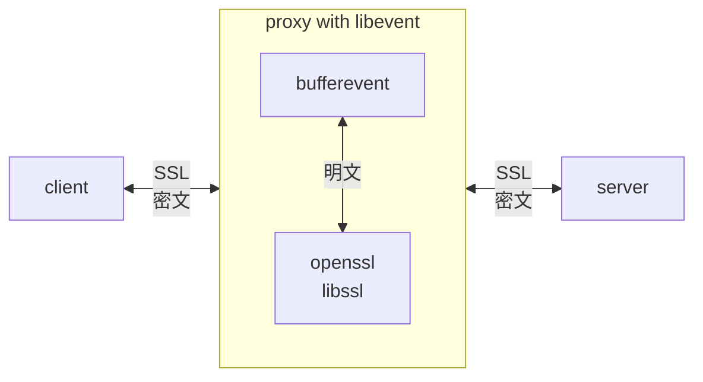
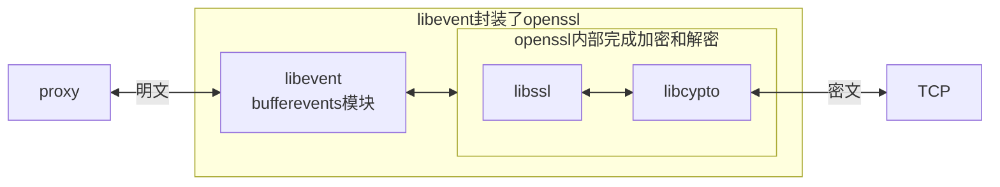
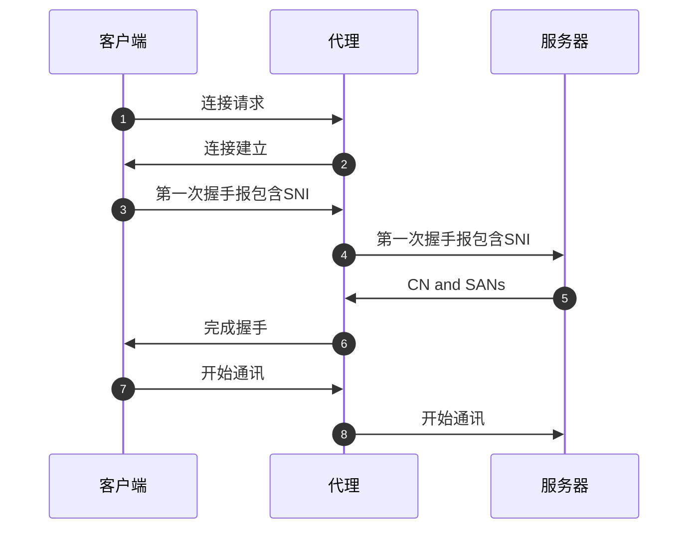
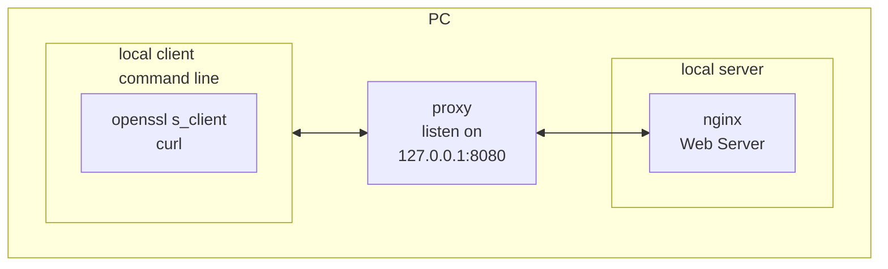

# MITM 代理

MITM代理，解密/修改 https 流量


## 环境

运行平台： windows 10 专业版 （版本 22H2）

开发工具：VS2022 社区版

开发语言：C 语言

Wireshark：4.6.0， 抓包分析工具，开发阶段用于调试


| 开源代码 | 版本   | 备注                          |
| -------- | ------ | ----------------------------- |
| nginx    | 1.28.0 | https 服务器，可执行程序      |
| openssl  | 3.5.4  | SSL 协议，网站下载编译好的SDK |
| libevent | 2.1.12 | 异步事件库                    |


## 架构选择

2025/11/18 写

做了一半才发现，用 libevent 更为简单。

因为 libevent 封装了 openssl 库。

[Bufferevents: advanced topics](https://libevent.org/libevent-book/Ref6a_advanced_bufferevents.html)

Bufferevents can use the OpenSSL library to implement the SSL/TLS secure transport layer.


如同封装了TCP 连接和读写，SSL 的连接和读写也做了异步处理。

如果用 libevent ，则无需处理 SSL 的细节，无需处理加密和解密。

只需要分别和客户端，服务器端建立两个 SSL 连接即可。

openssl 和 libevent 做细节处理。


当时不用libevent，是因为听说 libevent 在windows 上性能不佳。

而且当初已经学习了许多 TLS 知识，想自己实现。


最优选择：libenvt 先实现一个 https 代理；再实现 MITM 代理。SSL连接由 openssl 处理。

使用了openssl 的连接库 libssl 和加密库 libcrypto


现在选择：libuv  先实现一个 https 代理；不处理SSL 连接，只是转发而已；但是需要处理加密和解密。

只使用了openssl 的加密库 libcrypto


|             | libuv 当前实现         | libevent 理想实现             |
| ----------- | ---------------------- | ----------------------------- |
| openssl     | 只使用加密库 libcrypto | 使用了所有库 libssl,libcrypto |
| SSL/TLS连接 | 只是转发，不处理       | 自动处理                      |
| 加密和解密  | 自己处理               | 自动处理                      |


------

# 软件架构


## 原则

代理设计原则：

- 代理尽可能简洁
- 代理只负责加密和解密
- 其它逻辑尽量放在应用层


## 总体架构

整体架构



代理的内部结构




## 握手阶段




------

# 调试

以下操作都在本机 Win10 系统上操作。

相关配置文件放在源代码目录：res 子目录下


## 本机nginx服务

具体步骤：

[openssl-2-搭建https服务器 - 知乎](https://zhuanlan.zhihu.com/p/1958572249872332446)


以下是简要描述。

下载nginx 软件：nginx-1.28.0.zip

[nginx](https://nginx.org/en/)


使用 openssl 创建自签名证书

```bash
1. 创建 CA 根证书
openssl req -x509 -nodes -new -sha256 -days 1024 -newkey rsa:2048 -keyout RootCA.key -out RootCA.crt -subj "/C=CN/CN=albert-CA"

2. 安装这个证书，受信任的根证书颁发机构

用 CA 证书生成网站证书
3. 生成网站私钥对 server.key 和证书签名请求 server.csr
openssl req -new -nodes -newkey rsa:2048 -keyout server.key -out server.csr -subj "/C=CN/CN=albert"

4. 再用 CA 签名
openssl x509 -req -sha256 -days 1024 -in server.csr -CA RootCA.crt -CAkey RootCA.key -extfile domains.ext -out server.crt
```


以上命令行输出4个文件： RootCA.crt， server.key， server.crt

1. RootCA.crt：根证书，安装到win10 操作系统中： 受信任的根证书颁发机构
2. RootCA.key：根证书的私钥，将来用于生成证书签名
3. server.crt：本地 https 服务器的证书文件

4. **server.key**：本地 https 服务器的密钥文件

把server.crt 和 server.key拷贝到 nginx\ssl 目录下

```nginx
ssl_certificate      ./ssl/server.crt;
ssl_certificate_key  ./ssl/server.key;
```


## 本机测试环境

proxy.h

#define DEBUG


```bash
# start nignx server
nginx

# start proxy
cmitimproxy.exe

# start TLS client, only test TLS handshake
openssl s_client -connect localhost:443  -proxy 127.0.0.1:8080 -brief

# or use curl, download index.html
curl -x 127.0.0.1:8080 -k https://localhost
```

openssl 或者 curl 会触发断点。

其它连接不会触发断点，因为不走代理。

这样调试很简单，只处理关心的网络连接，网络环境很清爽。


原理图：



这样搭建测试环境，可以有效排除干扰。

本机环境下就可以测试解密 https 流量。


### 解密TLS

wireshark 抓取代理和远程服务器的通讯：解密

protossl_dstssl_create -> SSL_CTX_set_keylog_callback(sslctx, keylog_callback);

protossl_srcsslctx_create -> SSL_CTX_set_keylog_callback(sslctx, keylog_callback);

```c
static void keylog_callback(const SSL* ssl, const char* line)
{
	//printf("KEYLOG: %s\n", line);
	FILE* keylog_file = fopen("r:\\log.txt", "a");
	if (keylog_file) {
		fprintf(keylog_file, "%s\n", line);
		fclose(keylog_file);
	}
}
```

密钥记录在 r:\\log.txt

wireshark 编辑 - 首选项 - protocols - TLS - Pre-Master-Secret log filename

设置为 r:\\log.txt，抓到的包就是解密的。


### 调试握手协议

```bash

openssl s_client -connect localhost:443  -proxy 127.0.0.1:8080 -brief 
```


### 调试HTTPs

```bash
curl -x 127.0.0.1:8080  -k -v  https://localhost
```


------


# 注意事项

开发过程中，proxy.h，定义了

#define DEBUG


最终发行时，需要注释这一行：

//#define DEBUG


## 打印信息

以下信息是 libevent 打印的

```bash
[msg] Nameserver 192.168.31.1:53 has failed: request timed out.
[msg] All nameservers have failed
```


------


# 开发日志

2025/11/13 开始开发

2025/11/23，从 V0.0.5 开始，转向 libevent 开发。之前采用 libuv 框架。

2025/11/30，完成了客户端和服务器端的SSL握手，准备应用层通讯。

2025/12/5，完成了证书制作。

2025/12/7，完成了简单的网页内容修改，可以修改https 流量

2025/12/9，开始写微信视频下载 app，用的是这个代理

2025/12/12，可以得到要修改的 JavaScript 文件，这个文件是用 br（Brotli ）压缩的。

​	需要解压后，送到应用层；

​	如果应用层修改了，还需要再用 Brotli 压缩，再发送到客户端。

压缩方式有 3种：br, gzip, deflate 

需要支持这 3种，包括解压和压缩。

2025/12/17，完成了库本身的开发；并且完成了和微信短视频下载程序的联合测试。

使用这个库，可以成功下载微信短视频。
